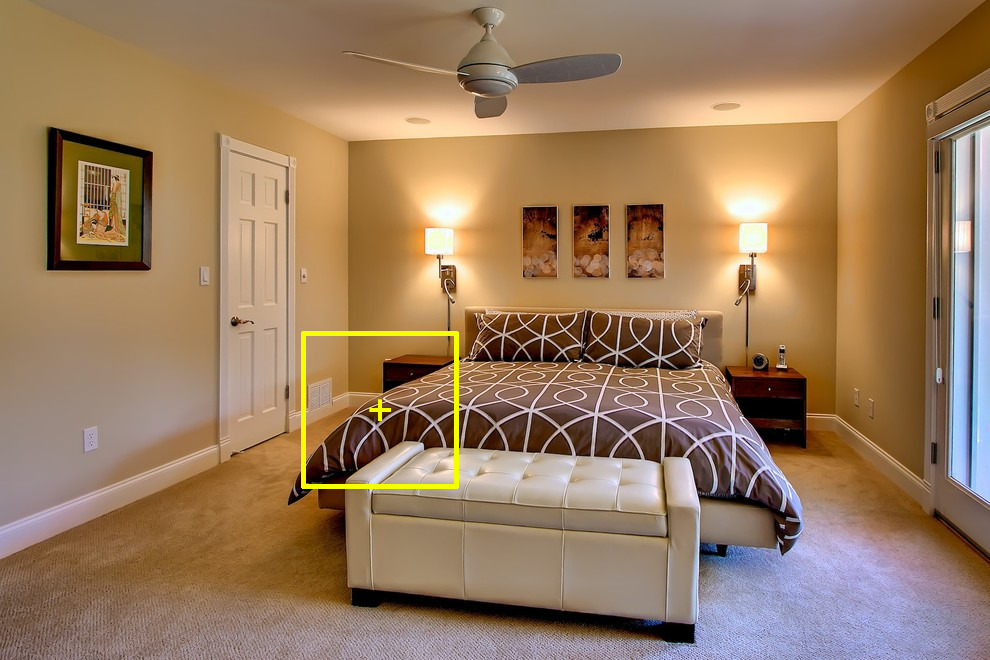
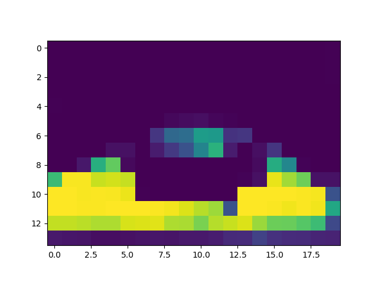
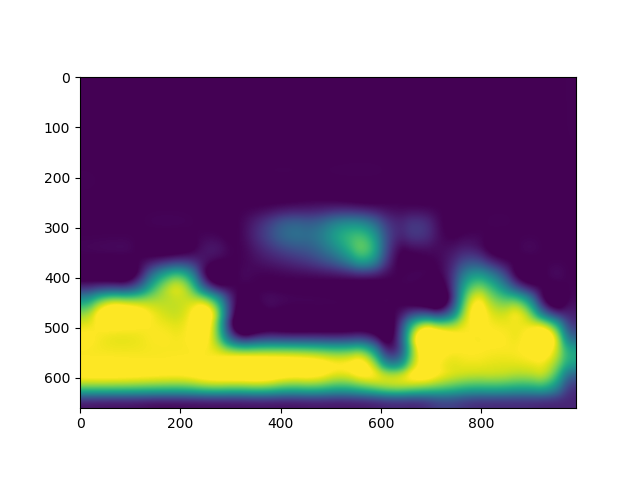
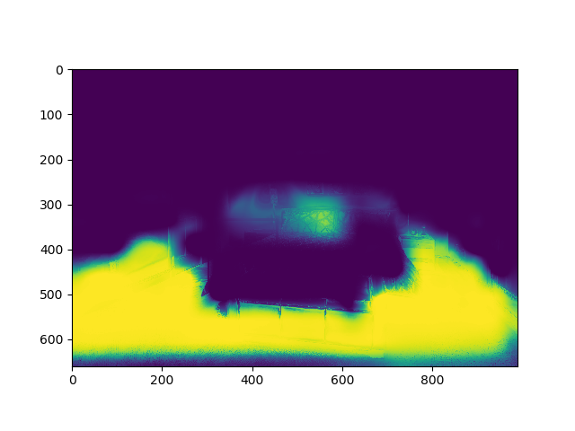
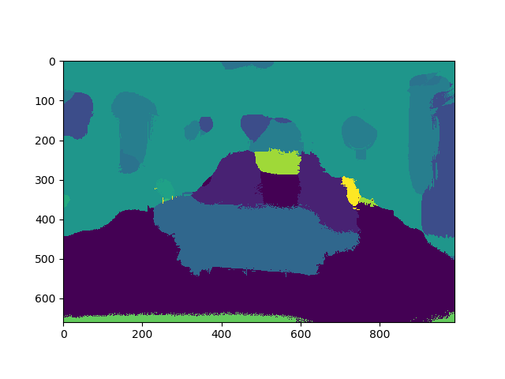

# MINC FULL SCENE SEGMENTATION

This repository hosts a proof of concept for MINC full-scene segmentation. It is based on the trained models and the script provided in

```
@article{bell15minc,
	author = "Sean Bell and Paul Upchurch and Noah Snavely and Kavita Bala",
	title = "Material Recognition in the Wild with the Materials in Context Database",
	journal = "Computer Vision and Pattern Recognition (CVPR)",
	year = "2015",
}
```

References:

```
https://github.com/lucasb-eyer/pydensecrf
https://github.com/keunhong/kitnn/blob/master/kitnn/models/minc.py
```


The script has been adapted to our specific needs, namely:

1. Perform patch classification on the whole image via sliding window
2. Upsample output and pass it to a CRF to obtain full-scene segmentation.


## Installation

Installing Caffe used to be a pain in the `5*7*13`. This time it was very straightforward by using conda on ubuntu 18.04: https://anaconda.org/conda-forge/caffe

The ``pydensecrf`` dependency requires ``cython``. Apart from that, it should work out fine with few installs from a fresh environment.


## Tutorials on CRF:

https://www.youtube.com/watch?v=rc3YDj5GiVM  
https://www.youtube.com/watch?v=nZVH4Rwj9-U  
https://github.com/seth814/Semantic-Shapes/blob/master/CRF%20Cat%20Demo.ipynb  


## Gallery:

The following images exemplify the pipeline.








## TODO:

* Replace sliding window with more efficient method (YOLO? sampling?)
* Fix padding when upsizing
* Hyperparametrize/train CRF
